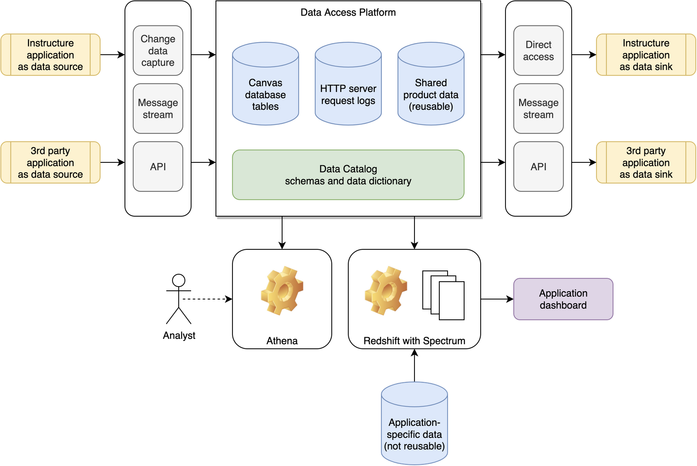
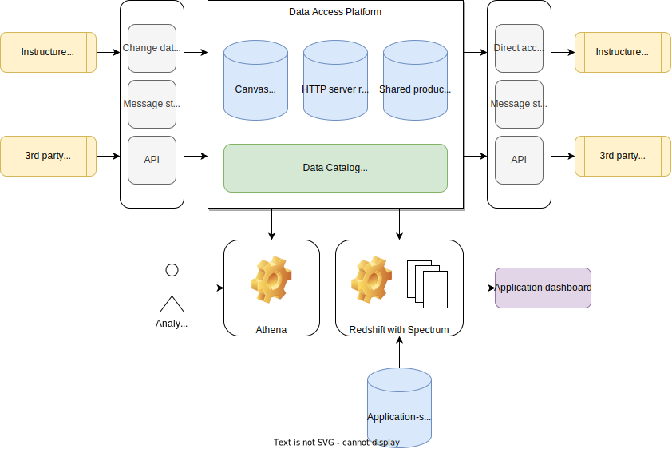

<!-- confluence-page-id: 85668266616 -->

# Publish Markdown to Confluence

This page demonstrates the various features of converting a Markdown document into an XHTML document compliant with the Confluence storage format. 

## Basic features

Text with **bold**, *italic*, `monospace`, <ins>underline</ins> and ~~strikethrough~~.

Link to an [external location](http://example.com/).

An ordered list:

1. List item 1
2. List item 2
3. List item 3

An unordered list:

* List item 1
* List item 2
* List item 3





## Code blocks

A language-neutral code block:
```
func:
    preformatted text
```

A code block in Python:
```python
def func(n: int) -> str:
    return str(n)
```

A code block in Java:
```java
class Simple {  
    public static void main(String args[]) {  
        System.out.println("Hello Java!");  
    }  
}
```

A code block in JSON:
```json
{
    "boolean": true,
    "integer": 42,
    "string": "value",
    "list": [1,2,3]
}
```

## Sections

Lorem ipsum dolor sit amet, consectetur adipiscing elit. Aliquam dignissim sem vel tortor scelerisque sodales. Quisque id faucibus massa. Integer enim nulla, cursus vel facilisis id, convallis in nunc. Suspendisse potenti. Aenean vehicula semper fringilla. Nulla pretium vitae enim sed feugiat. Integer molestie a elit ac fermentum.

### Subsection 1

Integer vel cursus neque. Ut a ex orci. Nulla elementum lacus sed accumsan rutrum. Donec dui augue, porta at diam quis, ultricies rhoncus ipsum. Aliquam posuere mollis varius. Ut tempor velit facilisis ligula mattis consectetur. Praesent sit amet enim vitae est facilisis auctor vitae at nisi. Aliquam erat volutpat. Donec commodo vestibulum lorem sit amet semper. Vivamus vestibulum sem bibendum, pretium risus aliquam, pharetra augue. Donec id quam sit amet est cursus elementum ut eget massa. Duis vel sapien nunc. Phasellus dui risus, auctor eu erat vitae, vehicula dignissim justo. Morbi nec auctor leo. Praesent tincidunt faucibus tortor in iaculis.

### Subsection 2

Nullam a dictum urna, volutpat convallis purus. Fusce at vulputate mauris. Donec dignissim id nisl quis ultricies. Quisque pulvinar nulla risus, vel tincidunt felis pretium hendrerit. Pellentesque placerat, mi vel luctus tristique, sem nisi volutpat dolor, vitae pulvinar ipsum orci vitae ligula. Morbi tempus at tortor sed volutpat. Vivamus facilisis orci libero, ac fermentum metus iaculis eget. Morbi aliquam enim et semper dapibus. Suspendisse ut velit sit amet metus convallis elementum. Cras sagittis justo ac venenatis pulvinar. Integer est massa, blandit vel nulla at, dignissim finibus dui.
