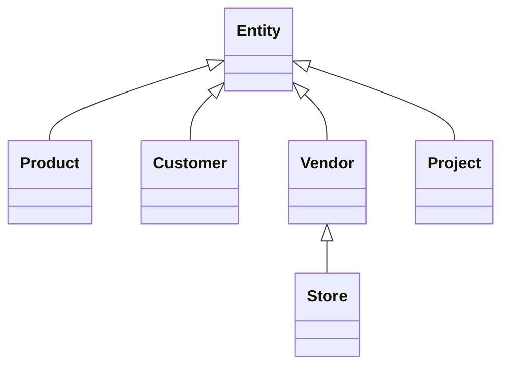

Prefer PNG over SVG if both are available in the same directory:

Extracted editable draw.io diagram with `render_drawio=False`, uploaded PNG image with `render_drawio=True`:

Editable draw.io diagram with `render_drawio=False`, static image with `render_drawio=True`:

Editable Mermaid diagram with `render_mermaid=False`, static image with `render_mermaid=True`:

Static image hosted at an external location:

Code block that produces an editable Mermaid diagram with `render_mermaid=False`, or a static image with `render_mermaid=True`:

[PDF document](docs/sample.pdf)

[Word processor document](docs/sample.docx)

[Spreadsheet document](docs/sample.xlsx)

[LibreOffice Writer document](docs/sample.odt)

[LibreOffice Calc document](docs/sample.ods)
