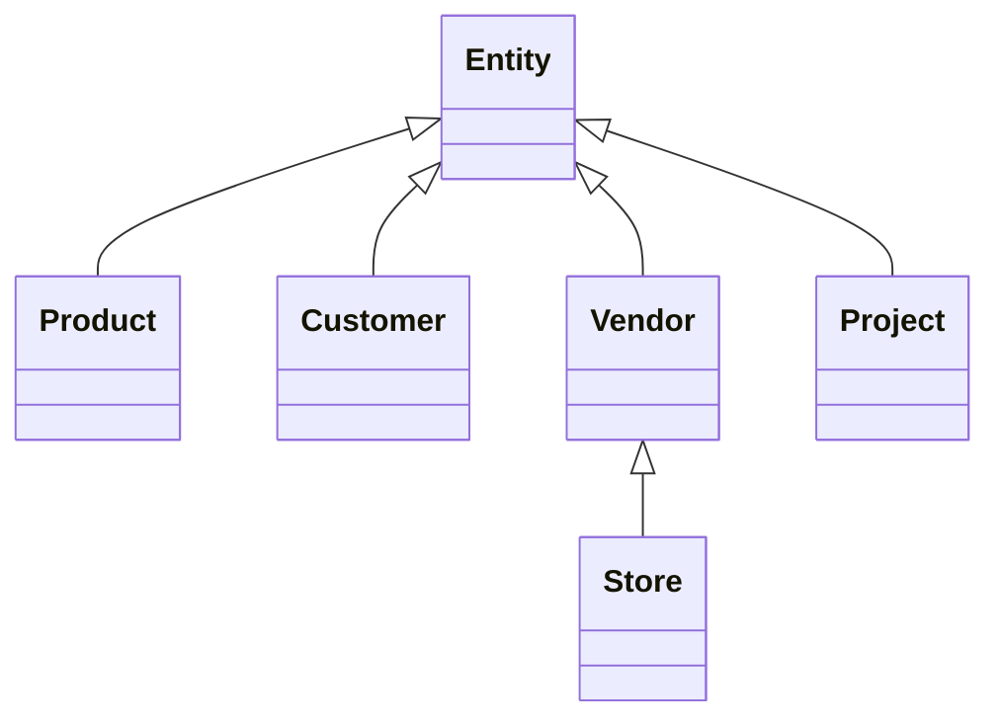

<!-- confluence-page-id: 1933314 -->

If you are a user who wants to publish pages to Confluence, you should install the package [markdown-to-confluence](https://pypi.org/project/markdown-to-confluence/) from PyPI. If you are a developer who wants to contribute, you should clone the repository [md2conf](https://github.com/hunyadi/md2conf) from GitHub.

# Publish Markdown to Confluence

This page demonstrates the various features of converting a Markdown document into an XHTML document compliant with the *Confluence Storage Format*.

## Basic features

Text with **bold**, *italic*, `monospace`, <ins>underline</ins> and ~~strikethrough~~.

Text with subscript (H<sub>2</sub>O) and superscript (X<sup>2</sup>).

Absolute link to an [external location](http://example.com/) or relative link to a [heading in the same document](#Basic-features). Relative links to other pages are also supported if you are synchronizing a directory tree, not a single file. "Naked" links such as URLs and e-mails are automatically identified: <https://example.com> and <mailto:me@example.com>. Relative URLs to locations not exported may be skipped.

An ordered list:

1. *List item 1*
2. **List item 2**
spanning multiple text file lines but rendered as a single line
3. _List item 3_
4. `List item 4`

A bullet point list:

* *List item 1*
* **List item 2**
spanning multiple text file lines but rendered as a single line
* _List item 3_
* `List item 4`

An unordered list:

- *List item 1*
- **List item 2**
spanning multiple text file lines but rendered as a single line
- _List item 3_
- `List item 4`

A nested list:

* List item 1
    * Nested item 1
        1. Item 1 ![gray][STATUS-GRAY]
        2. Item 2 ![purple][STATUS-PURPLE]
        3. Item 3 ![blue][STATUS-BLUE]
    * Nested item 2
        - Item 4 ![red][STATUS-RED]
        - Item 5 ![yellow][STATUS-YELLOW]
        - Item 6 ![green][STATUS-GREEN]
* List item 2
    1. Nested item 3 <input type="date" value="1984-01-01" />
    2. Nested item 4 <input type="date" value="2024-12-31" />

A tasklist:

- [x] **Finished** action
- [ ] **Unfinished** action


A Mermaid diagram:



Confluence Storage Format macro passed unchanged to Confluence:

```csf
<ac:structured-macro ac:name="panel" ac:schema-version="1" ac:macro-id="aa7f545b-2616-4edc-9bb6-406ec6403515">
  <ac:parameter ac:name="panelIconId">1f642</ac:parameter>
  <ac:parameter ac:name="panelIcon">:slight_smile:</ac:parameter>
  <ac:parameter ac:name="panelIconText">🙂</ac:parameter>
  <ac:parameter ac:name="bgColor">#FFF0B3</ac:parameter>
  <ac:rich-text-body>
    <p>A <em>custom colored panel</em> with a 🙂 emoji</p>
  </ac:rich-text-body>
</ac:structured-macro>
```

UTF-8 characters outside of the ASCII range are also supported: e.g. árvíztűrő tükörfúrógép. :smile:

## Code blocks

A language-neutral code block:
```
func:
    preformatted text
```

A code block in Python:
```python
def func(n: int) -> str:
    return str(n)
```

A code block in Java:
```java
class Simple {
    public static void main(String args[]) {
        System.out.println("Hello Java!");
    }
}
```

A code block in JSON:
```json
{
    "boolean": true,
    "integer": 42,
    "string": "value",
    "list": [1,2,3]
}
```

## LaTeX math equations

Inline formulas can be enclosed with `$` signs: $\sum_{i=1}^{n} i = \frac{n(n+1)}{2}$, or delimited with `\(` and `\)`: \(\lim _{x\rightarrow \infty }\frac{1}{x}=0\).

Block formulas can be wrapped with `$$`:

$$\frac{-b\pm \sqrt{b^{2}-4ac}}{2a}$$

Code blocks with language `math` are also supported:

```math
\int _{a}^{b}f(x)dx=F(b)-F(a)
```

## Footnotes

Footnote with numeric notation [^1] and string identifier [^string].

## Sections

[Link to Subsection 1](#subsection-1) | [Link to Subsection 2](#subsection-2) | Lorem ipsum dolor sit amet, consectetur adipiscing elit. Aliquam dignissim sem vel tortor scelerisque sodales. Quisque id faucibus massa. Integer enim nulla, cursus vel facilisis id, convallis in nunc. Suspendisse potenti. Aenean vehicula semper fringilla. Nulla pretium vitae enim sed feugiat. Integer molestie a elit ac fermentum.

### Subsection 1

Integer vel cursus neque. Ut a ex orci. Nulla elementum lacus sed accumsan rutrum. Donec dui augue, porta at diam quis, ultricies rhoncus ipsum. Aliquam posuere mollis varius. Ut tempor velit facilisis ligula mattis consectetur. Praesent sit amet enim vitae est facilisis auctor vitae at nisi. Aliquam erat volutpat. Donec commodo vestibulum lorem sit amet semper. Vivamus vestibulum sem bibendum, pretium risus aliquam, pharetra augue. Donec id quam sit amet est cursus elementum ut eget massa. Duis vel sapien nunc. Phasellus dui risus, auctor eu erat vitae, vehicula dignissim justo. Morbi nec auctor leo. Praesent tincidunt faucibus tortor in iaculis.

### Subsection-2

Nullam a dictum urna, volutpat convallis purus. Fusce at vulputate mauris. Donec dignissim id nisl quis ultricies.
Quisque pulvinar nulla risus, vel tincidunt felis pretium hendrerit. Pellentesque placerat, mi vel luctus tristique,
sem nisi volutpat dolor, vitae pulvinar ipsum orci vitae ligula. Morbi tempus at tortor sed volutpat. Vivamus
facilisis orci libero, ac fermentum metus iaculis eget. Morbi aliquam enim et semper dapibus. Suspendisse ut velit sit
amet metus convallis elementum. Cras sagittis justo ac venenatis pulvinar. Integer est massa, blandit vel nulla at,
dignissim finibus dui.

## Tables

| Left | Center | Right |
|:-----|:------:|------:|
| Bal  | Közép  | Jobb  |

| Name | Description                 |
| ---- | --------------------------- |
| Data | A multi-line<br/>paragraph. |

## Admonitions

Markdown has no native support for admonitions. Admonitions that follow the [Python-Markdown syntax](https://python-markdown.github.io/extensions/admonition/) are converted into Confluence structured macros, which are shown as info panels. (See [Alerts](#alerts) for an alternative that has pretty output in both GitHub and Confluence.)

!!! info
    This is an information panel.

!!! info "Optional explicit title"
    This is an information panel with an explicit title.

    This is the second paragraph with a [link](https://example.com/).

!!! tip "Tip of the day"
    This is a structured macro panel showing a tip.

!!! note "A note"
    This is a structured macro panel showing a note.

!!! warning "A warning message"
    This is a structured macro panel showing a warning.

## Alerts

Alerts are a Markdown extension based on the blockquote syntax that you can use to emphasize critical information. [GitHub](https://docs.github.com/en/get-started/writing-on-github/getting-started-with-writing-and-formatting-on-github/basic-writing-and-formatting-syntax#alerts) and [GitLab](https://docs.gitlab.com/ee/development/documentation/styleguide/#alert-boxes) display them with distinctive colors and icons to indicate the significance of the content. When converted to Confluence, they are represented as structured macros, which are displayed as info panels.

Note:

> [!NOTE]
> Useful information that users should know, even when skimming content.

Tip:

> [!TIP]
> Helpful advice for doing things better or more easily.

Important:

> [!IMPORTANT]
> Key information users need to know to achieve their goal.

Warning:

> [!WARNING]
> Urgent info that needs immediate user attention to avoid problems.

Caution:

> [!CAUTION]
> Advises about risks or negative outcomes of certain actions.

## Collapsed sections

The [GitHub-specific](https://docs.github.com/en/get-started/writing-on-github/working-with-advanced-formatting/organizing-information-with-collapsed-sections) formatting tag `<details>` that produces a collapsed section block is converted into the Confluence structured macro *expand* with a similar appearance. Behind the scenes, *md2conf* uses [Markdown in HTML](https://python-markdown.github.io/extensions/md_in_html/) to parse the content of the `<details>` element as Markdown, which is why you must always include the attribute `markdown="1"` on `<details>`:

```markdown
<details markdown="1">
<summary>Tips for collapsed sections</summary>

You can add text within a collapsed section.

You can add an image or a code block, too.
</details>
```

<details markdown="1">
<summary>Tips for collapsed sections</summary>

You can add text within a collapsed section.

You can add an image or a code block, too.

```ruby
puts "Hello World"
```
</details>

[^1]: This is a footnote with *numeric* notation.
[^string]: This is a footnote with a *string identifier*.

## Colors

Text in <span style="color: rgb(255,86,48);">red</span>, <span style="color: rgb(54,179,126);">green</span> and <span style="color: rgb(76,154,255);">blue</span>.

Highlight in <span style="background-color: rgb(198,237,251);">teal</span>, <span style="background-color: rgb(211,241,167);">lime</span> and <span style="background-color: rgb(254,222,200);">yellow</span>.

## Table of contents

[[_TOC_]]

## Child pages

[[_LISTING_]]
