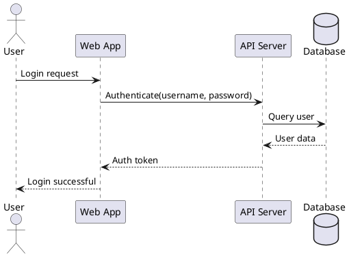
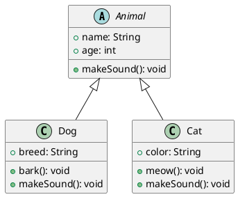
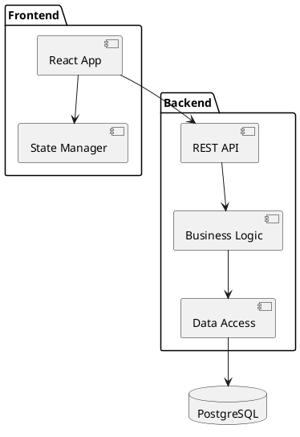

If you are a user who wants to publish pages to Confluence, you should install the package [markdown-to-confluence](https://pypi.org/project/markdown-to-confluence/) from PyPI. If you are a developer who wants to contribute, you should clone the repository [md2conf](https://github.com/hunyadi/md2conf) from GitHub.

[PlantUML](https://plantuml.com/) is an open-source tool that allows you to create diagrams from a plain text language. You can include PlantUML diagrams in your documents to create visual representations of systems, processes, and relationships.

## Sequence Diagram

Sequence diagrams show how objects interact with each other over time. They are useful for modeling the dynamic behavior of a system and understanding message flows between components.

## Class Diagram

Class diagrams visualize the structure of a system by showing its classes, attributes, methods, and relationships. They are essential for object-oriented design.

## Component Diagram

Component diagrams illustrate the organization and dependencies among software components, helping to visualize system architecture.

