<!-- confluence-page-id: 00000000000 -->

[Mermaid](https://mermaid.js.org/) is a simple and powerful diagramming and charting tool that uses a markdown-like syntax.

You can include Mermaid diagrams in your documents to create visual representations of systems, processes, and relationships.

# Example Mermaid Diagrams

## Class diagrams

Class diagrams are a type of UML diagram that visually represent
the relationships between classes in a software system. They show
the classes, their attributes, and the methods they contain, as
well as the relationships between them, such as inheritance,
association, and aggregation. Class diagrams are used to model the
static structure of a system, providing a blueprint for its
implementation.

## Pie charts

Pie charts are a type of chart that displays data as slices of a
circle, where the size of each slice is proportional to the value
it represents.  They are useful for visualizing the relative
proportions of different categories within a dataset.  This example
shows the relative time spent looking for a movie versus watching
it on Netflix.

## Sequence diagrams

UML Sequence diagrams are a type of interaction diagram that shows
how objects in a system interact with each other over time. They
are used to model the dynamic behavior of a system, showing the
sequence of messages that are exchanged between objects. Sequence
diagrams are often used to model the flow of control in a system,
such as the steps involved in processing a request or handling an
event.

## Mindmaps

Mindmaps are a visual representation of hierarchical information,
using branches radiating from a central node to represent relationships
between concepts. They are often used for brainstorming, note-taking,
and knowledge organization, allowing users to visually map out ideas
and connections. Mindmaps can be created using pen and paper or
specialized software tools like Mermaid.

A timeline is a type of diagram that visually represents events and
activities over a period of time. It is used to illustrate the
sequence of events, milestones, or tasks in a project or process,
providing a clear overview of the timeline and dependencies.

Quadrant diagrams are a visual representation of a matrix with four
quadrants, each representing a different combination of two variables.
They are often used for prioritization, decision-making, and
problem-solving.

A quadrant diagram typically has two axes, each representing a
different variable. The axes are usually labeled with opposite ends
of a spectrum, such as "Important" vs. "Not Important" or "Urgent"
vs. "Not Urgent". The four quadrants are then defined by the
intersection of these axes.

```mermaid
%%{init: {"quadrantChart": {"chartWidth": 400, "chartHeight": 400}, "themeVariables": {"quadrant1TextFill": "#ff0000"} }}%%
quadrantChart
  x-axis Urgent --> Not Urgent
  y-axis Not Important --> "Important ❤"
  quadrant-1 Plan
  quadrant-2 Do
  quadrant-3 Delegate
  quadrant-4 Delete
```

