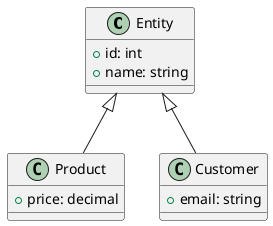
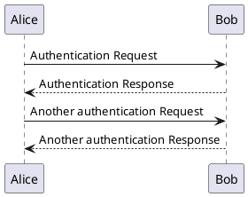
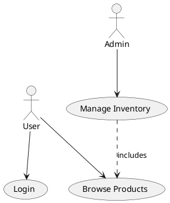

<!-- confluence-page-id: 00000000000 -->

[PlantUML](https://plantuml.com/) is an open-source tool that allows users to create diagrams from a plain text language.

You can include PlantUML diagrams in your documents to create visual representations of systems, processes, and relationships.

# Example PlantUML Diagrams

## Class diagrams

Class diagrams are a type of UML diagram that visually represent
the relationships between classes in a software system. They show
the classes, their attributes, and the methods they contain, as
well as the relationships between them, such as inheritance,
association, and aggregation.

## Sequence diagrams

UML Sequence diagrams are a type of interaction diagram that shows
how objects in a system interact with each other over time. They
are used to model the dynamic behavior of a system.

## Use case diagrams

Use case diagrams show the interactions between actors and use cases
in a system. They are used to capture the functional requirements
of a system.

