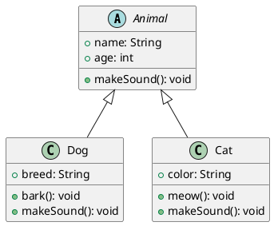
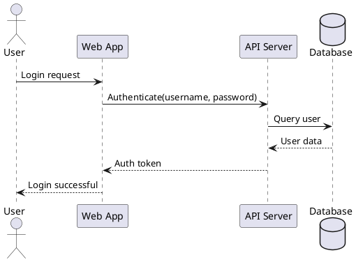
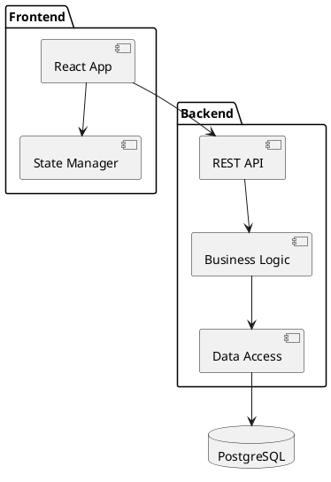
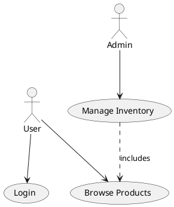

<!-- confluence-page-id: 00000000000 -->

[PlantUML](https://plantuml.com/) is an open-source utility that facilitates the rapid creation of a wide array of diagrams using plain text.

You can include PlantUML diagrams in your documents to create visual representations of systems, processes, and relationships.

## Class diagrams

Class diagrams visualize the structure of a system by showing its classes, attributes, methods, and relationships. They are essential for object-oriented design.

## Sequence diagrams

Sequence diagrams show how objects interact with each other over time. They are useful for modeling the dynamic behavior of a system and understanding message flows between components.

## Component diagrams

Component diagrams illustrate the organization and dependencies among software components, helping to visualize system architecture.

## Use case diagrams

Use case diagrams show the interactions between actors and use cases in a system. They are used to capture functional requirements of a system.

